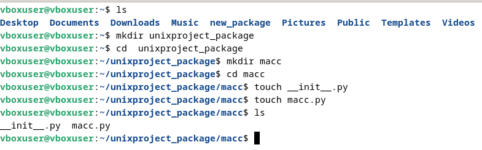
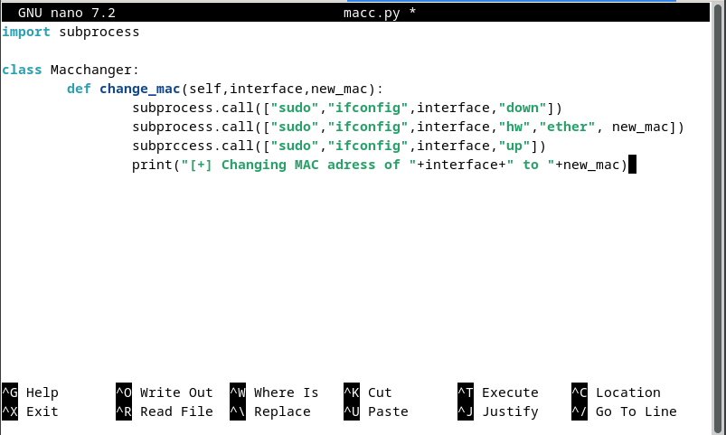
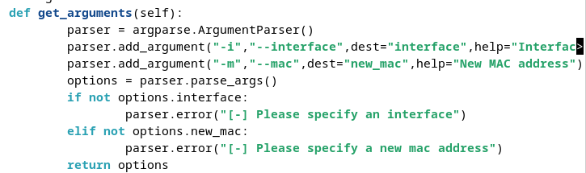
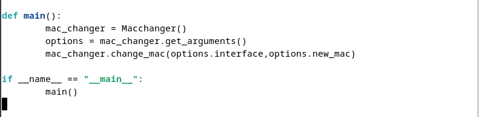
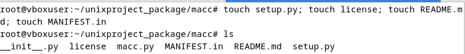
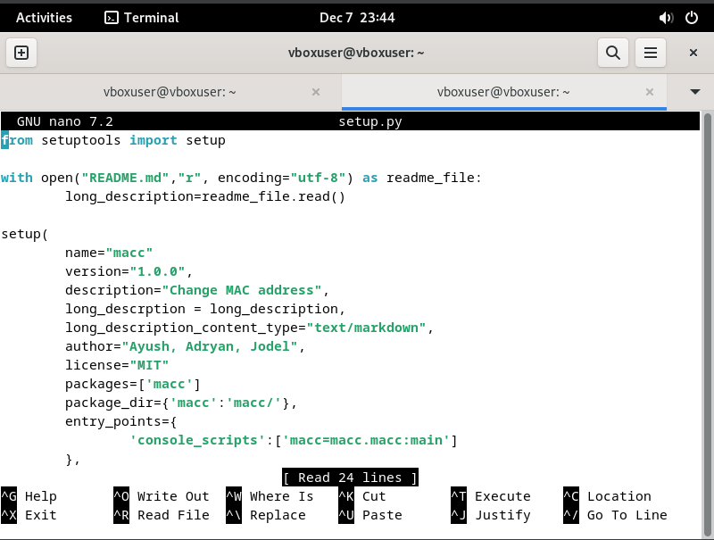
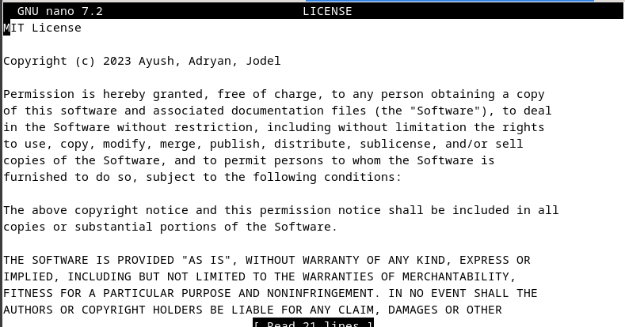
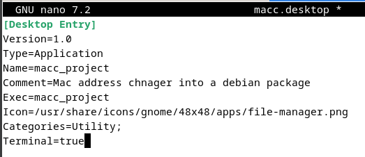
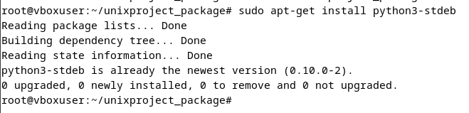

# Unix-Final-Project
Packaging a Python Script to Debian

The purpose of this project is to automatically change the MAC address of your system using a Python script. However, we need to convert the Python script so we can run it on Debian. To do that, we will package the MAC address changer script to a .deb file.

### Step-by-Step Guide
**Step 1 - Making the working directories**

First, we will need to make the working directories where we will store our:
- Root directory
- Python Script

We will also make .py files to import our directory as a package and to hold our MAC change logic.

**Step 2 - Making the Python script**

Second, you will need to get or make your own Python script for the MAC address change. In this script there will be:
- The method to change the MAC address automatically
- The calling method
- The main method

**Step 3 - Set up**

Third, we will add files to prepare our package for distribution. This includes the README file and the license of the project.

This is what our license looks like.

We also made it so you can run the project from the desktop.

**Step 4 - Packaging**

Finally, we package the script so it can be able to run on Debian.

